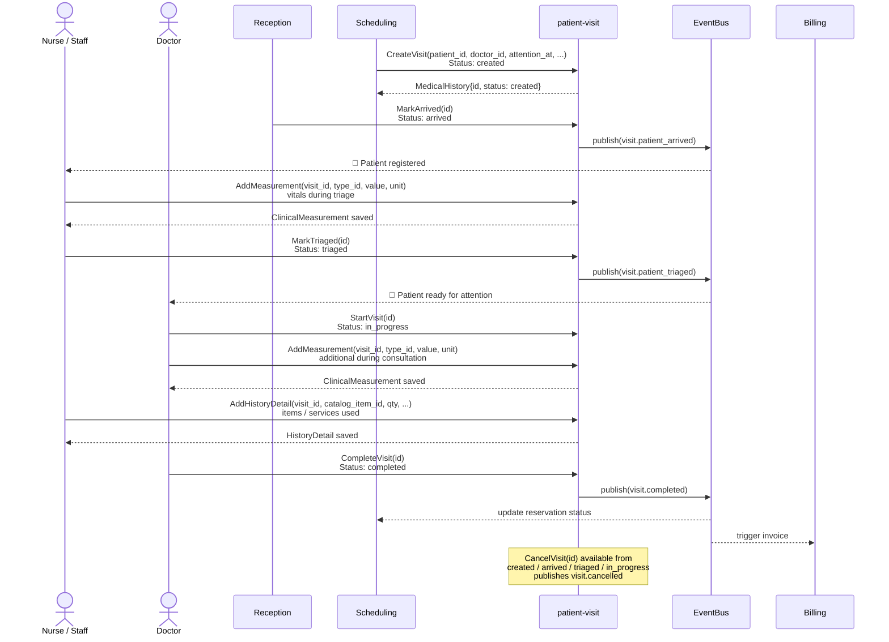

```mermaid
sequenceDiagram
    actor Nurse as Nurse / Staff
    actor Doctor
    participant Reception
    participant Scheduling
    participant patient-visit
    participant EventBus

    Scheduling->>patient-visit: CreateVisit(patient_id, doctor_id, attention_at, ...)<br/>Status: created
    patient-visit-->>Scheduling: MedicalHistory{id, status: created}

    Reception->>patient-visit: MarkArrived(id)<br/>Status: arrived
    patient-visit->>EventBus: publish(visit.patient_arrived)
    EventBus-->>Nurse: 🔔 Patient registered

    Nurse->>patient-visit: AddMeasurement(visit_id, type_id, value, unit)<br/>vitals during triage
    patient-visit-->>Nurse: ClinicalMeasurement saved

    Nurse->>patient-visit: MarkTriaged(id)<br/>Status: triaged
    patient-visit->>EventBus: publish(visit.patient_triaged)
    EventBus-->>Doctor: 🔔 Patient ready for attention

    Doctor->>patient-visit: StartVisit(id)<br/>Status: in_progress

    Doctor->>patient-visit: AddMeasurement(visit_id, type_id, value, unit)<br/>additional during consultation
    patient-visit-->>Doctor: ClinicalMeasurement saved

    Nurse->>patient-visit: AddHistoryDetail(visit_id, catalog_item_id, qty, ...)<br/>items / services used
    patient-visit-->>Nurse: HistoryDetail saved

    Doctor->>patient-visit: CompleteVisit(id)<br/>Status: completed
    patient-visit->>EventBus: publish(visit.completed)
    EventBus-->>Scheduling: update reservation status
    EventBus-->>Billing: trigger invoice

    note over patient-visit: CancelVisit(id) available from<br/>created / arrived / triaged / in_progress<br/>publishes visit.cancelled
```
